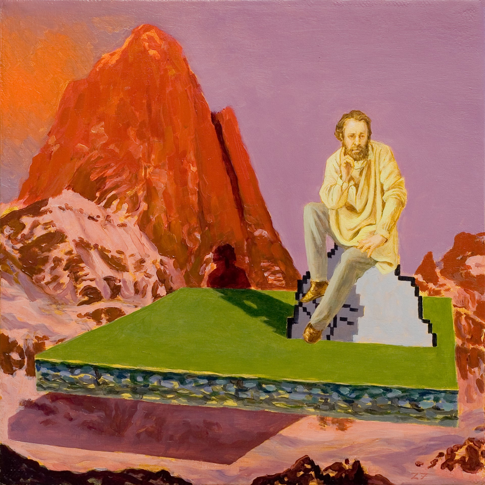

+++
title = "About"
[extra]
footer = ""
+++

# About

 
<figure>

<figcaption>Monologue, by Kristoffer Zetterstrand (2007).</figcaption>
</figure>
 

Welcome to my blog! My name's Daniel Yu, and I'm currently studying computer science at Stevens Institute of Technology (class of 2025). This blog is a place where I plan on sharing my thoughts about science, technology, art, and life.

If you're interested in keeping up with me, or just looking further into the things I've written about, feel free to check out the links that I've listed <a href="/links">here</a>.

See you around!

